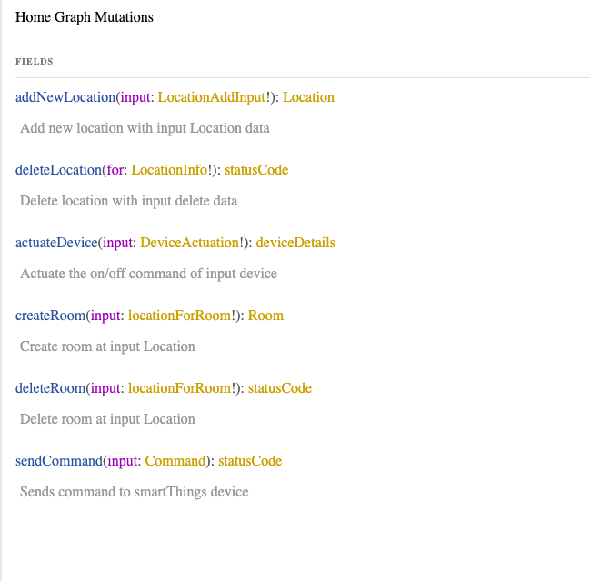

# Home Graph - *A data platform for the home*

## Introduction

Home Graph is based on [SmartThings](https://www.smartthings.com) a cloud based platform designed to support IOT applications. SmartThings itself has changed little in terms of its value since its introduction in 2013. There have of course been updates but the core focus and user benefits have changed little. At it's core SmartThings is about devices connected to a hub or directly to the smartThings cloud organized by motivated users into Locations and Rooms. SmartThings also provides a [developer workspace](https://smartthings.developer.samsung.com/workspace) to enable extensions to the primary SmartThings user experience on a Mobile device via "smartApps"and automation services. SmartThings also provides a [REST API](https://smartthings.developer.samsung.com/docs/api-ref/st-api.html#) for more general development.

The AIX team in SRA have been working fairly intensely with the SmartThings REST API over the past 18 months creating new user experiences. As with many REST interfaces getting at the information you really need can take multiple calls. This caused the AIX team a few issues when trying to write voice based and new client experiences. For example a voice request to *"turn on all the lights in the kitchen"* might seem simple enough but in order to pull all the information needed using the REST API requires at least two REST calls and some filtering. This requires the building of custom services to support individual voice requests. The situation was similar in an advanced AR experience where trying to parse out the devices in a room required a lot of client side logic dealing with, and navigating the information encapsulated by the smartThings API.

Given these kinds of issues a new approach was needed. It was clear that SmartThings had created a logical data structure for a home around rooms so viewing the smart home as a hierarchical data structure it was clear what was needed was an efficient way to navigate that structure.

Home Graph uses SmartThings data and is based on GraphQL, a query language developed and open-sourced by Facebook. It provides a powerful API to get exactly the data you need in a single request, seamlessly traversing and combining data sources. Using Graphql rather than REST for SmartThings allows applications and services to make complex queries or updates in one call. Home Graph also supports the seamless extension of the the SmartThings API allowing both service and data integration.

The use of Graphql to simplify access to smartThings data opened an entirely new way to view data in the home. One where new services could be added to augment the SmartThings structure or entirely separate services related to the home or family could be included. What Home Graph is, is less a smartthings simplification but more a general data model for the home.

The rest of this document discusses the use of Home Graph.

## Home Graph Queries

SmartThings exposes a logical structure of Locations (Homes), Rooms and Devices so the Home Graph adopts this general structure and extends it.

### Locations

A **Location** in general equates to a Home, or a significant geolocation managed by smartThings. From a user standpoint Locations are named using a familiar moniker, from a SmartThings standpoint Locations have a unique Id. A Location can be further organized into Rooms, such as "Kitchen" or "Bedroom".

The general model for [Location](#location) and the default fields as defined my SmartThings is shown below

|  |
| :-----------------------------------------------------: |
|        *Query to get all Locations for account*         |

The result fields  shown (on right side ) in the image above contain the typical fields of comparable SmartThings REST call however via Graphql it's possible to dive much deeper into the SmartThings Structure. The [Location](#location) includes a `rooms` field which pulls back the room information for each location.

|  |
| :------------------------------------------------------------------: |
|         *Query to get all Locations plus rooms for account*          |

One Graphql request returns what would have taken multiple REST calls to the SmartThings API. This is not all, since a smartThings Location includes geolocation new geo sevices can be added. For example the [Location](#location) includes fields for `weather` and `airQuality` which have nothing to do with the smartThings API at all. These are third party services that can easily be added integrated into the Home Graph API. For example this:

|  |
| :----------------------------------------------------------------------: |
|           *Query to get weather at all Locations for account*            |

Demonstrates the user of the `weather` field which pull weather from a cloud service. This seamless integration demonstrates the power of Home Graph to create a comprehensive data layer for the home. There are many methods to enable such integration;

- schema inclusion - as shown in the weather case
- schema stitching - where two schemas are stitched together at runtime from separate services (e.g [Yelp Graphql API](https://www.yelp.com/developers/graphql/guides/intro))
- federation - The use of two graphql services.

Using Home graph new services and other data models (e.g home blog, shopping list, tv guide, noticeboard) can be integrated very easily and able new client experiences as well as new device experiences to be created.

### Rooms

Access to rooms from a Location has been shown above. In SmartThings Rooms contain devices and the Home graph [Room](#room) type includes a property to get all the devices in a room

|  |
| :----------------------------------------------: |
|        *Query room information a devices*        |

A room within a home serves a function therefore the Home Graph Room type is infact a base-type (interface) that can be specialized for the function of a room. Most homes have a space to prepare food, a space to sleep and a space to be entertained or relax. Each room can have specialized services attached to them which support the function of that space. An online cookbook in the kitchen prehaps, a set of books for relaxing before bed, a playlist or watchlist in the living room.

This kind customization really demonstrates the power of Home Graph in supporting unique experiences in the home.

|  |
| :----------------------------------------------: |
|        *Rooms of type Office have a Stock Service Attached*        |

In the above image a stock ticker sevice has been attached to an Office. This service supports the function of the Office and the service will supply stock quotes. An ambient display or TV in the Office could take advantage of this service and show a ticker tape for relevant stocks

### Devices

The lowest level of the SmartThings system is the device layer, Devices belong to Locations and Rooms. The Rooms object has a field to go an retrieve the devices within a room as shown above. There is also a global query which can be used to find all the devices in an Account.

|  |
| :----------------------------------------------: |
|        *Query All Devices with Max Results*        |

As can be seen from the above the query to get all devices can take a max input which enables paging. The the case above the query wants a max of 5 responses. The `nextPage` response indicates the index of the next page which can be passed into the query as shown below in the `page` param.

|  |
| :----------------------------------------------: |
|        *Query All Devices with Paging*        |

Device status provides access to the current state of all the Capabilities of the device.

|  |
| :----------------------------------------------: |
|        *Get the status of all device capabilities*        |

It is also possible to get the current status of a specific capability as shown below in getting the temperature of all the motion detectors.


|  |
| :----------------------------------------------: |
|        *Get the status of single device capability*        |


## Home Graph Mutations

In Graphql Mutations unlike queries change state, HomeGraph exposes the following Mutations.


| |
| :--------------------------------------------: |
|        *List of Mutations*        |

### Add New Location

The `addNewLocation` mutation is used to create a new Location within a SmartThings account. Locations represent a Geolocation therefore the latitude and longitude of the location must be supplied along with a country code and name all other inputs are optional the full list of input arguments to this mutation are

- name: Is the human readable name of the newly created location
- countryCode: Schema type that represents a ISO Alpha 3 country
- latitude: Geospatial Latitude of the Location
- longitude: Geospatial Longitude of the Location
- regionRadius: The radius in meters around latitude and longitude which defines this location.
- temperatureScale: The desired temperature scale used within location. Value can be F or C.
- locale: Schema type value for an IETF BCP 47 language tag representing the chosen locale for this location.

This mutation returns a new Location type with unique `locationId` or null if an error occurs

|  |
| :----------------------------------------------: |
|        *Creating a new location named Test*        |


### Delete Location

The `deleteLocation` mutation will delete an existing location along with all its room and detach any devices linked to that location. Devices are not deleted they are simply removed from the location. This mutation can use either Location Name or locationId to determine which location to delete. Since it is possible (though not advised) that two Locations associated with a SmartThings account may have the same name it is safer to use LocationId. The deleteLocation mutation returns a mutation result Status indication


|  |
| :----------------------------------------------: |
|        *Deleting location using the LocationId*        |


### Create room

The `createRoom` mutation will create a room within a location. A Room in HomeGraph is a abstract type and currently the type of a Room is derived from the Room name. To create a room the mutation needs a Room name and either a location name and or locationId. The createRoom mutation returns a Room object.

|  |
| :----------------------------------------------: |
|        *Creating a room called foo in test location*        |

### Delete room
The `deleteRoom` mutation will delete a room within a Location. To detele a room the mutation needs a Room name and either a location name and or locationId. The deleteRoom mutation mutation result Status indication.

|  |
| :----------------------------------------------: |
|        *Deleting a room called foo in test location*        |

### Device commands
There are two mutations that deal with controlling devices `actuateDevice` and `sendCommand`. The former can be used for on off actuations of a device it was singled out because its the most common control on a device. The latter can be used to send any command offered by a device as specified [here](https://smartthings.developer.samsung.com/docs/api-ref/capabilities.html#Capabilities)

The `actuateDevice` mutation accepts a device name and the the command is `on` or `off` as shown below

|  |
| :----------------------------------------------: |
|        *Use of actuateDevice Mutation turning off a device*        |

The `sendCommand` mutation provides far more flexibity has been implemented to mirror the functionality of the SmartThings [sendCommand](https://smartthings.developer.samsung.com/docs/api-ref/st-api.html#operation/executeDeviceCommands) so the input params are much the same as detailed below:

- deviceId : The unique ID of the device to which the command should be sent.
- capability : The capability to the command belongs as specified [here](https://smartthings.developer.samsung.com/docs/api-ref/capabilities.html#Capabilities)
- component : The component name within the device.
- command : The name of the command to send
- args : a mixed type array of arguments to be sent with the command

Send Command returns a mutation result Status indication. An example of sending a `setCoolingSetpoint` command to a thermostat is shown below as an example.

|  |
| :----------------------------------------------: |
|        *Sending the setCoolingSetpoint to thermostat*        |


## Deployment Options

There are two main deployment models supported by HomeGraph. These are explained below. There is some general configuration which is required for all modes. This is done via a `.env` file with the following

```
SMARTTHINGS_TOKEN=SmartThings API token, https://account.smartthings.com/tokens
FINHUB_KEY= API Key for https://finnhub.io/ used only for Stock service
CLIMACELL_API=API key for https://www.climacell.co/weather-api/pricing/ used for airquality information

```

### Serverless

The default deployment method is to deploy to AWS as a Lambda service. This is a very cost effective method since it has a generous free tier and when charged the billing is done on use.

To deploy to AWS ensure that the serverless environment has been fully[configured](https://www.serverless.com/framework/docs/providers/aws/cli-reference/config-credentials/)

Once configuration is completed the HomeGraph lambda can be deployed with `serverless deploy`

### Node Library

HomeGraph used as a Node package (**Needs to be deployed to package service**) which can then be included into other projects to enable extensions through graphql [federation](https://www.apollographql.com/docs/apollo-server/federation/introduction/) and or [schema stitching](https://www.apollographql.com/docs/graphql-tools/schema-stitching/). This provides any number of integrations with other services or extension of Room types.

As a library HomeGraph can be repurposed as a standalone service for development purposes. The following segment demonstates configuration as an [Express](https://expressjs.com/) service

```
require('dotenv').config();
const path = require('path');
const fs = require('fs');
const express = require('express');
const graphqlHTTP = require('express-graphql');
const { makeExecutableSchema } = require('graphql-tools');
const bodyParser = require('body-parser');
const resolvers = require('../../lib/graphutils/resolvers');
const schema = require('HomeGraph');

const app = express();
app.use(bodyParser.urlencoded({ extended: true }));
app.use(bodyParser.json());

app.get('/', async (req, res) => {
  res.send(`Hello World!`);
});

app.use(
  '/graphql',
  graphqlHTTP({
    schema,
    graphiql: true,
  })
);

app.listen(4000);
```


# Schema Types

<details>
  <summary><strong>Table of Contents</strong></summary>

  * [Query](#query)
  * [Mutation](#mutation)
  * [Objects](#objects)
    * [AirQuality](#airquality)
    * [Capability](#capability)
    * [Component](#component)
    * [Device](#device)
    * [DeviceList](#devicelist)
    * [Location](#location)
    * [Office](#office)
    * [STRoom](#stroom)
    * [Stock](#stock)
    * [Weather](#weather)
    * [deviceDetails](#devicedetails)
    * [statusCode](#statuscode)
  * [Inputs](#inputs)
    * [Command](#command)
    * [DeviceActuation](#deviceactuation)
    * [LocationAddInput](#locationaddinput)
    * [LocationDeleteInput](#locationdeleteinput)
    * [LocationInfo](#locationinfo)
    * [Page](#page)
    * [RoomInfo](#roominfo)
    * [Symbol](#symbol)
    * [locationForRoom](#locationforroom)
  * [Enums](#enums)
    * [CountryCode](#countrycode)
    * [Locale](#locale)
    * [TemperatureScale](#temperaturescale)
    * [onOff](#onoff)
  * [Scalars](#scalars)
    * [Anything](#anything)
    * [Boolean](#boolean)
    * [Float](#float)
    * [Int](#int)
    * [String](#string)
  * [Interfaces](#interfaces)
    * [Room](#room)

</details>

## Query
Home Graph Queries

<table>
<thead>
<tr>
<th align="left">Field</th>
<th align="right">Argument</th>
<th align="left">Type</th>
<th align="left">Description</th>
</tr>
</thead>
<tbody>
<tr>
<td colspan="2" valign="top"><strong>getLocations</strong></td>
<td valign="top">[<a href="#location">Location</a>!]!</td>
<td>

Get all the Locations

</td>
</tr>
<tr>
<td colspan="2" valign="top"><strong>getLocation</strong></td>
<td valign="top"><a href="#location">Location</a></td>
<td>

Get Specific Location Information

</td>
</tr>
<tr>
<td colspan="2" align="right" valign="top">for</td>
<td valign="top"><a href="#locationinfo">LocationInfo</a>!</td>
<td></td>
</tr>
<tr>
<td colspan="2" valign="top"><strong>getRoom</strong></td>
<td valign="top"><a href="#room">Room</a></td>
<td>

Get data for a specific room in a location

</td>
</tr>
<tr>
<td colspan="2" align="right" valign="top">for</td>
<td valign="top"><a href="#roominfo">RoomInfo</a>!</td>
<td></td>
</tr>
<tr>
<td colspan="2" valign="top"><strong>getAllDevices</strong></td>
<td valign="top"><a href="#devicelist">DeviceList</a>!</td>
<td>

Gets all devices across all locations

</td>
</tr>
<tr>
<td colspan="2" align="right" valign="top">page</td>
<td valign="top"><a href="#int">Int</a></td>
<td></td>
</tr>
<tr>
<td colspan="2" align="right" valign="top">max</td>
<td valign="top"><a href="#int">Int</a></td>
<td></td>
</tr>
<tr>
<td colspan="2" valign="top"><strong>getAllDevicesOfType</strong></td>
<td valign="top"><a href="#devicelist">DeviceList</a>!</td>
<td>

Gets all devices of a certain type

</td>
</tr>
<tr>
<td colspan="2" align="right" valign="top">typeId</td>
<td valign="top"><a href="#string">String</a>!</td>
<td></td>
</tr>
<tr>
<td colspan="2" valign="top"><strong>getWeather</strong></td>
<td valign="top"><a href="#weather">Weather</a></td>
<td>

Get the weather at a Location

</td>
</tr>
<tr>
<td colspan="2" align="right" valign="top">location</td>
<td valign="top"><a href="#locationinfo">LocationInfo</a>!</td>
<td></td>
</tr>
<tr>
<td colspan="2" valign="top"><strong>getAirQuality</strong></td>
<td valign="top"><a href="#airquality">AirQuality</a></td>
<td>

Get the airQuality at a Location

</td>
</tr>
<tr>
<td colspan="2" align="right" valign="top">location</td>
<td valign="top"><a href="#locationinfo">LocationInfo</a>!</td>
<td></td>
</tr>
<tr>
<td colspan="2" valign="top"><strong>getStockPrice</strong></td>
<td valign="top"><a href="#stock">Stock</a></td>
<td>

Get the stock price of underlying ticker

</td>
</tr>
<tr>
<td colspan="2" align="right" valign="top">input</td>
<td valign="top"><a href="#symbol">Symbol</a>!</td>
<td></td>
</tr>
</tbody>
</table>

## Mutation
Home Graph Mutations

<table>
<thead>
<tr>
<th align="left">Field</th>
<th align="right">Argument</th>
<th align="left">Type</th>
<th align="left">Description</th>
</tr>
</thead>
<tbody>
<tr>
<td colspan="2" valign="top"><strong>addNewLocation</strong></td>
<td valign="top"><a href="#location">Location</a></td>
<td>

Add new location with input Location data

</td>
</tr>
<tr>
<td colspan="2" align="right" valign="top">input</td>
<td valign="top"><a href="#locationaddinput">LocationAddInput</a>!</td>
<td></td>
</tr>
<tr>
<td colspan="2" valign="top"><strong>deleteLocation</strong></td>
<td valign="top"><a href="#statuscode">statusCode</a></td>
<td>

Delete location with input delete data

</td>
</tr>
<tr>
<td colspan="2" align="right" valign="top">for</td>
<td valign="top"><a href="#locationinfo">LocationInfo</a>!</td>
<td></td>
</tr>
<tr>
<td colspan="2" valign="top"><strong>actuateDevice</strong></td>
<td valign="top"><a href="#statuscode">statusCode</a></td>
<td>

Actuate the on/off command of input device

</td>
</tr>
<tr>
<td colspan="2" align="right" valign="top">input</td>
<td valign="top"><a href="#deviceactuation">DeviceActuation</a>!</td>
<td></td>
</tr>
<tr>
<td colspan="2" valign="top"><strong>createRoom</strong></td>
<td valign="top"><a href="#room">Room</a></td>
<td>

Create room at input Location

</td>
</tr>
<tr>
<td colspan="2" align="right" valign="top">input</td>
<td valign="top"><a href="#locationforroom">locationForRoom</a>!</td>
<td></td>
</tr>
<tr>
<td colspan="2" valign="top"><strong>deleteRoom</strong></td>
<td valign="top"><a href="#statuscode">statusCode</a></td>
<td>

Delete room at input Location

</td>
</tr>
<tr>
<td colspan="2" align="right" valign="top">input</td>
<td valign="top"><a href="#locationforroom">locationForRoom</a>!</td>
<td></td>
</tr>
<tr>
<td colspan="2" valign="top"><strong>sendCommand</strong></td>
<td valign="top"><a href="#statuscode">statusCode</a></td>
<td>

Sends command to smartThings device

</td>
</tr>
<tr>
<td colspan="2" align="right" valign="top">input</td>
<td valign="top"><a href="#command">Command</a></td>
<td></td>
</tr>
</tbody>
</table>

## Objects

### AirQuality

Air quality type based on Breezometer

<table>
<thead>
<tr>
<th align="left">Field</th>
<th align="right">Argument</th>
<th align="left">Type</th>
<th align="left">Description</th>
</tr>
</thead>
<tbody>
<tr>
<td colspan="2" valign="top"><strong>time</strong></td>
<td valign="top"><a href="#string">String</a></td>
<td>

Timestamp for when air quality reading was taken"

</td>
</tr>
<tr>
<td colspan="2" valign="top"><strong>epaAqi</strong></td>
<td valign="top"><a href="#float">Float</a></td>
<td>

Air Quality Index per US EPA

</td>
</tr>
<tr>
<td colspan="2" valign="top"><strong>epaPrimaryPollutant</strong></td>
<td valign="top"><a href="#string">String</a></td>
<td>

Primary Pollutant per US EPA

</td>
</tr>
<tr>
<td colspan="2" valign="top"><strong>pm25</strong></td>
<td valign="top"><a href="#float">Float</a></td>
<td>

Particulate Matter < 2.5 μm

</td>
</tr>
<tr>
<td colspan="2" valign="top"><strong>pm10</strong></td>
<td valign="top"><a href="#float">Float</a></td>
<td>

Particulate Matter < 10 μm

</td>
</tr>
<tr>
<td colspan="2" valign="top"><strong>no2</strong></td>
<td valign="top"><a href="#float">Float</a></td>
<td>

Nitrogen Dioxide

</td>
</tr>
<tr>
<td colspan="2" valign="top"><strong>co</strong></td>
<td valign="top"><a href="#float">Float</a></td>
<td>

Carbon Monoxide

</td>
</tr>
<tr>
<td colspan="2" valign="top"><strong>so2</strong></td>
<td valign="top"><a href="#float">Float</a></td>
<td>

Sulfur Dioxide

</td>
</tr>
<tr>
<td colspan="2" valign="top"><strong>epaHealthConcern</strong></td>
<td valign="top"><a href="#string">String</a></td>
<td>

Health concern level based on EPA standard

</td>
</tr>
<tr>
<td colspan="2" valign="top"><strong>pollenTree</strong></td>
<td valign="top"><a href="#int">Int</a></td>
<td>

ClimaCell pollen index for Trees

</td>
</tr>
<tr>
<td colspan="2" valign="top"><strong>pollenWeed</strong></td>
<td valign="top"><a href="#int">Int</a></td>
<td>

ClimaCell pollen index for Weed

</td>
</tr>
<tr>
<td colspan="2" valign="top"><strong>pollenGrass</strong></td>
<td valign="top"><a href="#int">Int</a></td>
<td>

ClimaCell pollen index for Grass

</td>
</tr>
</tbody>
</table>

### Capability

Type for single Capability

<table>
<thead>
<tr>
<th align="left">Field</th>
<th align="right">Argument</th>
<th align="left">Type</th>
<th align="left">Description</th>
</tr>
</thead>
<tbody>
<tr>
<td colspan="2" valign="top"><strong>id</strong></td>
<td valign="top"><a href="#string">String</a></td>
<td>

User readible label for capability

</td>
</tr>
<tr>
<td colspan="2" valign="top"><strong>version</strong></td>
<td valign="top"><a href="#int">Int</a></td>
<td>

Version number

</td>
</tr>
</tbody>
</table>

### Component

A device may have multiple sub-systems and this is represented by a Component type

<table>
<thead>
<tr>
<th align="left">Field</th>
<th align="right">Argument</th>
<th align="left">Type</th>
<th align="left">Description</th>
</tr>
</thead>
<tbody>
<tr>
<td colspan="2" valign="top"><strong>id</strong></td>
<td valign="top"><a href="#string">String</a></td>
<td>

Unique ID of the component

</td>
</tr>
<tr>
<td colspan="2" valign="top"><strong>label</strong></td>
<td valign="top"><a href="#string">String</a></td>
<td>

User readible label for component e.g main

</td>
</tr>
<tr>
<td colspan="2" valign="top"><strong>capabilities</strong></td>
<td valign="top">[<a href="#capability">Capability</a>!]!</td>
<td>

All the capabilities supported by the component

</td>
</tr>
</tbody>
</table>

### Device

Representation of a device

<table>
<thead>
<tr>
<th align="left">Field</th>
<th align="right">Argument</th>
<th align="left">Type</th>
<th align="left">Description</th>
</tr>
</thead>
<tbody>
<tr>
<td colspan="2" valign="top"><strong>deviceId</strong></td>
<td valign="top"><a href="#string">String</a></td>
<td>

Unique identifier for a device

</td>
</tr>
<tr>
<td colspan="2" valign="top"><strong>name</strong></td>
<td valign="top"><a href="#string">String</a></td>
<td>

User friendly name of a device

</td>
</tr>
<tr>
<td colspan="2" valign="top"><strong>label</strong></td>
<td valign="top"><a href="#string">String</a></td>
<td>

User friendly name of a device

</td>
</tr>
<tr>
<td colspan="2" valign="top"><strong>location</strong></td>
<td valign="top"><a href="#location">Location</a></td>
<td>

The location a device belongs too

</td>
</tr>
<tr>
<td colspan="2" valign="top"><strong>room</strong></td>
<td valign="top"><a href="#room">Room</a></td>
<td>

The room a device is in

</td>
</tr>
<tr>
<td colspan="2" valign="top"><strong>deviceTypeId</strong></td>
<td valign="top"><a href="#string">String</a></td>
<td>

Unique type ID for device

</td>
</tr>
<tr>
<td colspan="2" valign="top"><strong>deviceTypeName</strong></td>
<td valign="top"><a href="#string">String</a></td>
<td>

User friendly name of device type

</td>
</tr>
<tr>
<td colspan="2" valign="top"><strong>deviceNetworkType</strong></td>
<td valign="top"><a href="#string">String</a></td>
<td>

The type used by the device to connect

</td>
</tr>
<tr>
<td colspan="2" valign="top"><strong>components</strong></td>
<td valign="top">[<a href="#component">Component</a>!]!</td>
<td>

Retrieves components with schema

</td>
</tr>
<tr>
<td colspan="2" valign="top"><strong>capabilityStatus</strong></td>
<td valign="top"><a href="#anything">Anything</a></td>
<td>

Generic Conponents status

</td>
</tr>
<tr>
<td colspan="2" align="right" valign="top">component</td>
<td valign="top"><a href="#string">String</a>!</td>
<td></td>
</tr>
<tr>
<td colspan="2" align="right" valign="top">capability</td>
<td valign="top"><a href="#string">String</a>!</td>
<td></td>
</tr>
<tr>
<td colspan="2" valign="top"><strong>status</strong></td>
<td valign="top">[<a href="#anything">Anything</a>!]</td>
<td>

The current status of capabilities

</td>
</tr>
<tr>
<td colspan="2" align="right" valign="top">capability</td>
<td valign="top"><a href="#string">String</a></td>
<td></td>
</tr>
</tbody>
</table>

### DeviceList

Paginated List of Devices

<table>
<thead>
<tr>
<th align="left">Field</th>
<th align="right">Argument</th>
<th align="left">Type</th>
<th align="left">Description</th>
</tr>
</thead>
<tbody>
<tr>
<td colspan="2" valign="top"><strong>devices</strong></td>
<td valign="top">[<a href="#device">Device</a>!]!</td>
<td>

Page list of Devices

</td>
</tr>
<tr>
<td colspan="2" valign="top"><strong>more</strong></td>
<td valign="top"><a href="#boolean">Boolean</a></td>
<td>

Indication if there are more devices

</td>
</tr>
<tr>
<td colspan="2" valign="top"><strong>nextPage</strong></td>
<td valign="top"><a href="#string">String</a></td>
<td>

Next Page number

</td>
</tr>
</tbody>
</table>

### Location

A Location is a Home or Geographic area

<table>
<thead>
<tr>
<th align="left">Field</th>
<th align="right">Argument</th>
<th align="left">Type</th>
<th align="left">Description</th>
</tr>
</thead>
<tbody>
<tr>
<td colspan="2" valign="top"><strong>name</strong></td>
<td valign="top"><a href="#string">String</a></td>
<td>

The human readable name of a location

</td>
</tr>
<tr>
<td colspan="2" valign="top"><strong>locationId</strong></td>
<td valign="top"><a href="#string">String</a></td>
<td>

A unique ID that represents a Location

</td>
</tr>
<tr>
<td colspan="2" valign="top"><strong>countryCode</strong></td>
<td valign="top"><a href="#string">String</a></td>
<td>

The international country code for a Location

</td>
</tr>
<tr>
<td colspan="2" valign="top"><strong>latitude</strong></td>
<td valign="top"><a href="#float">Float</a></td>
<td>

The latitude for the location

</td>
</tr>
<tr>
<td colspan="2" valign="top"><strong>longitude</strong></td>
<td valign="top"><a href="#float">Float</a></td>
<td>

The longitude for the location

</td>
</tr>
<tr>
<td colspan="2" valign="top"><strong>regionRadius</strong></td>
<td valign="top"><a href="#int">Int</a></td>
<td>

This is the radius in meters around the latitude and longitude which defines this Location

</td>
</tr>
<tr>
<td colspan="2" valign="top"><strong>temperatureScale</strong></td>
<td valign="top"><a href="#string">String</a></td>
<td>

This indicates if temperatures should be listed in Centigrade or Fahrenheit

</td>
</tr>
<tr>
<td colspan="2" valign="top"><strong>timeZoneId</strong></td>
<td valign="top"><a href="#string">String</a></td>
<td>

The international timezone label

</td>
</tr>
<tr>
<td colspan="2" valign="top"><strong>locale</strong></td>
<td valign="top"><a href="#string">String</a></td>
<td>

The international two character locale label

</td>
</tr>
<tr>
<td colspan="2" valign="top"><strong>rooms</strong></td>
<td valign="top">[<a href="#room">Room</a>!]!</td>
<td>

Gets all the rooms within a location

</td>
</tr>
<tr>
<td colspan="2" valign="top"><strong>weather</strong></td>
<td valign="top"><a href="#weather">Weather</a></td>
<td>

Gets the weather at the location

</td>
</tr>
<tr>
<td colspan="2" valign="top"><strong>airQuality</strong></td>
<td valign="top"><a href="#airquality">AirQuality</a></td>
<td>

Gets the airquality at the location

</td>
</tr>
<tr>
<td colspan="2" valign="top"><strong>fireHazard</strong></td>
<td valign="top"><a href="#float">Float</a></td>
<td>

Fire hazard Index

</td>
</tr>
</tbody>
</table>

### Office

<table>
<thead>
<tr>
<th align="left">Field</th>
<th align="right">Argument</th>
<th align="left">Type</th>
<th align="left">Description</th>
</tr>
</thead>
<tbody>
<tr>
<td colspan="2" valign="top"><strong>roomId</strong></td>
<td valign="top"><a href="#string">String</a>!</td>
<td>

Unique Room id

</td>
</tr>
<tr>
<td colspan="2" valign="top"><strong>locationId</strong></td>
<td valign="top"><a href="#string">String</a>!</td>
<td>

Location ID which the Room is in

</td>
</tr>
<tr>
<td colspan="2" valign="top"><strong>name</strong></td>
<td valign="top"><a href="#string">String</a>!</td>
<td>

User friendly name of the room

</td>
</tr>
<tr>
<td colspan="2" valign="top"><strong>devices</strong></td>
<td valign="top">[<a href="#device">Device</a>!]!</td>
<td>

The devices in a room

</td>
</tr>
<tr>
<td colspan="2" valign="top"><strong>stock</strong></td>
<td valign="top"><a href="#stock">Stock</a></td>
<td>

Gets the underlying stock price

</td>
</tr>
<tr>
<td colspan="2" align="right" valign="top">ticker</td>
<td valign="top"><a href="#string">String</a>!</td>
<td></td>
</tr>
</tbody>
</table>

### STRoom

<table>
<thead>
<tr>
<th align="left">Field</th>
<th align="right">Argument</th>
<th align="left">Type</th>
<th align="left">Description</th>
</tr>
</thead>
<tbody>
<tr>
<td colspan="2" valign="top"><strong>roomId</strong></td>
<td valign="top"><a href="#string">String</a>!</td>
<td>

Unique Space id"

</td>
</tr>
<tr>
<td colspan="2" valign="top"><strong>locationId</strong></td>
<td valign="top"><a href="#string">String</a>!</td>
<td>

Location ID which the space is in

</td>
</tr>
<tr>
<td colspan="2" valign="top"><strong>name</strong></td>
<td valign="top"><a href="#string">String</a>!</td>
<td>

User friendly name of the room

</td>
</tr>
<tr>
<td colspan="2" valign="top"><strong>devices</strong></td>
<td valign="top">[<a href="#device">Device</a>!]!</td>
<td>

The devices in a room

</td>
</tr>
</tbody>
</table>

### Stock

Underlying Finincial Stock object

<table>
<thead>
<tr>
<th align="left">Field</th>
<th align="right">Argument</th>
<th align="left">Type</th>
<th align="left">Description</th>
</tr>
</thead>
<tbody>
<tr>
<td colspan="2" valign="top"><strong>currentPrice</strong></td>
<td valign="top"><a href="#string">String</a></td>
<td>

Current price

</td>
</tr>
<tr>
<td colspan="2" valign="top"><strong>highPrice</strong></td>
<td valign="top"><a href="#string">String</a></td>
<td>

High price of the day

</td>
</tr>
<tr>
<td colspan="2" valign="top"><strong>lowPrice</strong></td>
<td valign="top"><a href="#string">String</a></td>
<td>

Low price of the day

</td>
</tr>
<tr>
<td colspan="2" valign="top"><strong>openingPrice</strong></td>
<td valign="top"><a href="#string">String</a></td>
<td>

Open price of the day

</td>
</tr>
<tr>
<td colspan="2" valign="top"><strong>previousClose</strong></td>
<td valign="top"><a href="#string">String</a></td>
<td>

Previous close price

</td>
</tr>
<tr>
<td colspan="2" valign="top"><strong>time</strong></td>
<td valign="top"><a href="#string">String</a></td>
<td>

Timestamp

</td>
</tr>
<tr>
<td colspan="2" valign="top"><strong>symbol</strong></td>
<td valign="top"><a href="#string">String</a></td>
<td>

Stock symbol

</td>
</tr>
</tbody>
</table>

### Weather

The weather type based on openweather

<table>
<thead>
<tr>
<th align="left">Field</th>
<th align="right">Argument</th>
<th align="left">Type</th>
<th align="left">Description</th>
</tr>
</thead>
<tbody>
<tr>
<td colspan="2" valign="top"><strong>timestamp</strong></td>
<td valign="top"><a href="#int">Int</a></td>
<td>

Timestamp of weather reading

</td>
</tr>
<tr>
<td colspan="2" valign="top"><strong>location</strong></td>
<td valign="top"><a href="#string">String</a></td>
<td>

Location name

</td>
</tr>
<tr>
<td colspan="2" valign="top"><strong>condition</strong></td>
<td valign="top"><a href="#int">Int</a></td>
<td>

Symbol indicated weather icon to use

</td>
</tr>
<tr>
<td colspan="2" valign="top"><strong>description</strong></td>
<td valign="top"><a href="#string">String</a></td>
<td>

Text description of the weather

</td>
</tr>
<tr>
<td colspan="2" valign="top"><strong>temperature</strong></td>
<td valign="top"><a href="#float">Float</a></td>
<td>

Temperature in the unit scale defined by Location type

</td>
</tr>
<tr>
<td colspan="2" valign="top"><strong>pressure</strong></td>
<td valign="top"><a href="#float">Float</a></td>
<td>

The pressure at the location

</td>
</tr>
<tr>
<td colspan="2" valign="top"><strong>humidity</strong></td>
<td valign="top"><a href="#float">Float</a></td>
<td>

The humidity information

</td>
</tr>
<tr>
<td colspan="2" valign="top"><strong>wind_speed</strong></td>
<td valign="top"><a href="#float">Float</a></td>
<td>

The current windspeed

</td>
</tr>
<tr>
<td colspan="2" valign="top"><strong>wind_direction</strong></td>
<td valign="top"><a href="#int">Int</a></td>
<td>

The current wind direction

</td>
</tr>
<tr>
<td colspan="2" valign="top"><strong>cloud_cover</strong></td>
<td valign="top"><a href="#float">Float</a></td>
<td>

The percentage of cloud cove

</td>
</tr>
<tr>
<td colspan="2" valign="top"><strong>rain_volume</strong></td>
<td valign="top"><a href="#float">Float</a></td>
<td>

The current rain volume if any

</td>
</tr>
<tr>
<td colspan="2" valign="top"><strong>snow_volume</strong></td>
<td valign="top"><a href="#float">Float</a></td>
<td>

The current rain volume if any

</td>
</tr>
</tbody>
</table>

### deviceDetails

Device details

<table>
<thead>
<tr>
<th align="left">Field</th>
<th align="right">Argument</th>
<th align="left">Type</th>
<th align="left">Description</th>
</tr>
</thead>
<tbody>
<tr>
<td colspan="2" valign="top"><strong>deviceName</strong></td>
<td valign="top"><a href="#string">String</a></td>
<td>

deviceName

</td>
</tr>
<tr>
<td colspan="2" valign="top"><strong>command</strong></td>
<td valign="top"><a href="#string">String</a></td>
<td>

command

</td>
</tr>
</tbody>
</table>

### statusCode

General status reponse

<table>
<thead>
<tr>
<th align="left">Field</th>
<th align="right">Argument</th>
<th align="left">Type</th>
<th align="left">Description</th>
</tr>
</thead>
<tbody>
<tr>
<td colspan="2" valign="top"><strong>status</strong></td>
<td valign="top"><a href="#string">String</a></td>
<td>

Status code

</td>
</tr>
</tbody>
</table>

## Inputs

### Command

Input type to send a command to a device

<table>
<thead>
<tr>
<th colspan="2" align="left">Field</th>
<th align="left">Type</th>
<th align="left">Description</th>
</tr>
</thead>
<tbody>
<tr>
<td colspan="2" valign="top"><strong>deviceId</strong></td>
<td valign="top"><a href="#string">String</a>!</td>
<td>

device Id

</td>
</tr>
<tr>
<td colspan="2" valign="top"><strong>component</strong></td>
<td valign="top"><a href="#string">String</a>!</td>
<td>

component name (typically "main")

</td>
</tr>
<tr>
<td colspan="2" valign="top"><strong>capability</strong></td>
<td valign="top"><a href="#string">String</a>!</td>
<td>

Capability nae

</td>
</tr>
<tr>
<td colspan="2" valign="top"><strong>command</strong></td>
<td valign="top"><a href="#string">String</a>!</td>
<td>

Command

</td>
</tr>
<tr>
<td colspan="2" valign="top"><strong>args</strong></td>
<td valign="top">[<a href="#anything">Anything</a>!]</td>
<td>

Array of Args

</td>
</tr>
</tbody>
</table>

### DeviceActuation

Device Actuation type

<table>
<thead>
<tr>
<th colspan="2" align="left">Field</th>
<th align="left">Type</th>
<th align="left">Description</th>
</tr>
</thead>
<tbody>
<tr>
<td colspan="2" valign="top"><strong>deviceName</strong></td>
<td valign="top"><a href="#string">String</a></td>
<td>

Device name

</td>
</tr>
<tr>
<td colspan="2" valign="top"><strong>command</strong></td>
<td valign="top"><a href="#onoff">onOff</a></td>
<td>

Actuation command

</td>
</tr>
</tbody>
</table>

### LocationAddInput

Input to add a location

<table>
<thead>
<tr>
<th colspan="2" align="left">Field</th>
<th align="left">Type</th>
<th align="left">Description</th>
</tr>
</thead>
<tbody>
<tr>
<td colspan="2" valign="top"><strong>name</strong></td>
<td valign="top"><a href="#string">String</a>!</td>
<td>

Name of new Location

</td>
</tr>
<tr>
<td colspan="2" valign="top"><strong>countryCode</strong></td>
<td valign="top"><a href="#countrycode">CountryCode</a>!</td>
<td>

Country Code

</td>
</tr>
<tr>
<td colspan="2" valign="top"><strong>latitude</strong></td>
<td valign="top"><a href="#float">Float</a>!</td>
<td>

Latitude of Location

</td>
</tr>
<tr>
<td colspan="2" valign="top"><strong>longitude</strong></td>
<td valign="top"><a href="#float">Float</a>!</td>
<td>

Longitude of Location

</td>
</tr>
<tr>
<td colspan="2" valign="top"><strong>regionRadius</strong></td>
<td valign="top"><a href="#int">Int</a></td>
<td>

regionRadius

</td>
</tr>
<tr>
<td colspan="2" valign="top"><strong>temperatureScale</strong></td>
<td valign="top"><a href="#temperaturescale">TemperatureScale</a></td>
<td>

Temperature scale unit

</td>
</tr>
<tr>
<td colspan="2" valign="top"><strong>locale</strong></td>
<td valign="top"><a href="#locale">Locale</a></td>
<td>

Location

</td>
</tr>
</tbody>
</table>

### LocationDeleteInput

Location delete Input

<table>
<thead>
<tr>
<th colspan="2" align="left">Field</th>
<th align="left">Type</th>
<th align="left">Description</th>
</tr>
</thead>
<tbody>
<tr>
<td colspan="2" valign="top"><strong>locationId</strong></td>
<td valign="top"><a href="#string">String</a></td>
<td>

locationId

</td>
</tr>
</tbody>
</table>

### LocationInfo

LocationInfo

<table>
<thead>
<tr>
<th colspan="2" align="left">Field</th>
<th align="left">Type</th>
<th align="left">Description</th>
</tr>
</thead>
<tbody>
<tr>
<td colspan="2" valign="top"><strong>locationId</strong></td>
<td valign="top"><a href="#string">String</a></td>
<td>

LocationId

</td>
</tr>
<tr>
<td colspan="2" valign="top"><strong>name</strong></td>
<td valign="top"><a href="#string">String</a></td>
<td>

Location name

</td>
</tr>
</tbody>
</table>

### Page

Page

<table>
<thead>
<tr>
<th colspan="2" align="left">Field</th>
<th align="left">Type</th>
<th align="left">Description</th>
</tr>
</thead>
<tbody>
<tr>
<td colspan="2" valign="top"><strong>number</strong></td>
<td valign="top"><a href="#int">Int</a></td>
<td>

Page Number

</td>
</tr>
<tr>
<td colspan="2" valign="top"><strong>max</strong></td>
<td valign="top"><a href="#int">Int</a></td>
<td>

Max items in Page

</td>
</tr>
</tbody>
</table>

### RoomInfo

Room info Input

<table>
<thead>
<tr>
<th colspan="2" align="left">Field</th>
<th align="left">Type</th>
<th align="left">Description</th>
</tr>
</thead>
<tbody>
<tr>
<td colspan="2" valign="top"><strong>location</strong></td>
<td valign="top"><a href="#locationinfo">LocationInfo</a>!</td>
<td>

Location ID

</td>
</tr>
<tr>
<td colspan="2" valign="top"><strong>roomId</strong></td>
<td valign="top"><a href="#string">String</a></td>
<td>

Room Id

</td>
</tr>
<tr>
<td colspan="2" valign="top"><strong>name</strong></td>
<td valign="top"><a href="#string">String</a></td>
<td>

Room name

</td>
</tr>
</tbody>
</table>

### Symbol

Symbol

<table>
<thead>
<tr>
<th colspan="2" align="left">Field</th>
<th align="left">Type</th>
<th align="left">Description</th>
</tr>
</thead>
<tbody>
<tr>
<td colspan="2" valign="top"><strong>ticker</strong></td>
<td valign="top"><a href="#string">String</a></td>
<td>

Ticker

</td>
</tr>
</tbody>
</table>

### locationForRoom

Input to specify a room

<table>
<thead>
<tr>
<th colspan="2" align="left">Field</th>
<th align="left">Type</th>
<th align="left">Description</th>
</tr>
</thead>
<tbody>
<tr>
<td colspan="2" valign="top"><strong>roomName</strong></td>
<td valign="top"><a href="#string">String</a>!</td>
<td>

Name of room

</td>
</tr>
<tr>
<td colspan="2" valign="top"><strong>location</strong></td>
<td valign="top"><a href="#locationinfo">LocationInfo</a>!</td>
<td>

Location

</td>
</tr>
</tbody>
</table>

## Enums

### CountryCode

Country code

<table>
<thead>
<th align="left">Value</th>
<th align="left">Description</th>
</thead>
<tbody>
<tr>
<td valign="top"><strong>ABW</strong></td>
<td></td>
</tr>
<tr>
<td valign="top"><strong>AFG</strong></td>
<td></td>
</tr>
<tr>
<td valign="top"><strong>AGO</strong></td>
<td></td>
</tr>
<tr>
<td valign="top"><strong>AIA</strong></td>
<td></td>
</tr>
<tr>
<td valign="top"><strong>ALA</strong></td>
<td></td>
</tr>
<tr>
<td valign="top"><strong>ALB</strong></td>
<td></td>
</tr>
<tr>
<td valign="top"><strong>AND</strong></td>
<td></td>
</tr>
<tr>
<td valign="top"><strong>ANT</strong></td>
<td></td>
</tr>
<tr>
<td valign="top"><strong>ARE</strong></td>
<td></td>
</tr>
<tr>
<td valign="top"><strong>ARG</strong></td>
<td></td>
</tr>
<tr>
<td valign="top"><strong>ARM</strong></td>
<td></td>
</tr>
<tr>
<td valign="top"><strong>ASM</strong></td>
<td></td>
</tr>
<tr>
<td valign="top"><strong>ATA</strong></td>
<td></td>
</tr>
<tr>
<td valign="top"><strong>ATF</strong></td>
<td></td>
</tr>
<tr>
<td valign="top"><strong>ATG</strong></td>
<td></td>
</tr>
<tr>
<td valign="top"><strong>AUS</strong></td>
<td></td>
</tr>
<tr>
<td valign="top"><strong>AUT</strong></td>
<td></td>
</tr>
<tr>
<td valign="top"><strong>AZE</strong></td>
<td></td>
</tr>
<tr>
<td valign="top"><strong>BDI</strong></td>
<td></td>
</tr>
<tr>
<td valign="top"><strong>BEL</strong></td>
<td></td>
</tr>
<tr>
<td valign="top"><strong>BEN</strong></td>
<td></td>
</tr>
<tr>
<td valign="top"><strong>BFA</strong></td>
<td></td>
</tr>
<tr>
<td valign="top"><strong>BGD</strong></td>
<td></td>
</tr>
<tr>
<td valign="top"><strong>BGR</strong></td>
<td></td>
</tr>
<tr>
<td valign="top"><strong>BHR</strong></td>
<td></td>
</tr>
<tr>
<td valign="top"><strong>BHS</strong></td>
<td></td>
</tr>
<tr>
<td valign="top"><strong>BIH</strong></td>
<td></td>
</tr>
<tr>
<td valign="top"><strong>BLM</strong></td>
<td></td>
</tr>
<tr>
<td valign="top"><strong>BLR</strong></td>
<td></td>
</tr>
<tr>
<td valign="top"><strong>BLZ</strong></td>
<td></td>
</tr>
<tr>
<td valign="top"><strong>BMU</strong></td>
<td></td>
</tr>
<tr>
<td valign="top"><strong>BOL</strong></td>
<td></td>
</tr>
<tr>
<td valign="top"><strong>BRA</strong></td>
<td></td>
</tr>
<tr>
<td valign="top"><strong>BRB</strong></td>
<td></td>
</tr>
<tr>
<td valign="top"><strong>BRN</strong></td>
<td></td>
</tr>
<tr>
<td valign="top"><strong>BTN</strong></td>
<td></td>
</tr>
<tr>
<td valign="top"><strong>BVT</strong></td>
<td></td>
</tr>
<tr>
<td valign="top"><strong>BWA</strong></td>
<td></td>
</tr>
<tr>
<td valign="top"><strong>CAF</strong></td>
<td></td>
</tr>
<tr>
<td valign="top"><strong>CAN</strong></td>
<td></td>
</tr>
<tr>
<td valign="top"><strong>CCK</strong></td>
<td></td>
</tr>
<tr>
<td valign="top"><strong>CHE</strong></td>
<td></td>
</tr>
<tr>
<td valign="top"><strong>CHL</strong></td>
<td></td>
</tr>
<tr>
<td valign="top"><strong>CHN</strong></td>
<td></td>
</tr>
<tr>
<td valign="top"><strong>CIV</strong></td>
<td></td>
</tr>
<tr>
<td valign="top"><strong>CMR</strong></td>
<td></td>
</tr>
<tr>
<td valign="top"><strong>COD</strong></td>
<td></td>
</tr>
<tr>
<td valign="top"><strong>COG</strong></td>
<td></td>
</tr>
<tr>
<td valign="top"><strong>COK</strong></td>
<td></td>
</tr>
<tr>
<td valign="top"><strong>COL</strong></td>
<td></td>
</tr>
<tr>
<td valign="top"><strong>COM</strong></td>
<td></td>
</tr>
<tr>
<td valign="top"><strong>CPV</strong></td>
<td></td>
</tr>
<tr>
<td valign="top"><strong>CRI</strong></td>
<td></td>
</tr>
<tr>
<td valign="top"><strong>CUB</strong></td>
<td></td>
</tr>
<tr>
<td valign="top"><strong>CXR</strong></td>
<td></td>
</tr>
<tr>
<td valign="top"><strong>CYM</strong></td>
<td></td>
</tr>
<tr>
<td valign="top"><strong>CYP</strong></td>
<td></td>
</tr>
<tr>
<td valign="top"><strong>CZE</strong></td>
<td></td>
</tr>
<tr>
<td valign="top"><strong>DEU</strong></td>
<td></td>
</tr>
<tr>
<td valign="top"><strong>DJI</strong></td>
<td></td>
</tr>
<tr>
<td valign="top"><strong>DMA</strong></td>
<td></td>
</tr>
<tr>
<td valign="top"><strong>DNK</strong></td>
<td></td>
</tr>
<tr>
<td valign="top"><strong>DOM</strong></td>
<td></td>
</tr>
<tr>
<td valign="top"><strong>DZA</strong></td>
<td></td>
</tr>
<tr>
<td valign="top"><strong>ECU</strong></td>
<td></td>
</tr>
<tr>
<td valign="top"><strong>EGY</strong></td>
<td></td>
</tr>
<tr>
<td valign="top"><strong>ERI</strong></td>
<td></td>
</tr>
<tr>
<td valign="top"><strong>ESH</strong></td>
<td></td>
</tr>
<tr>
<td valign="top"><strong>ESP</strong></td>
<td></td>
</tr>
<tr>
<td valign="top"><strong>EST</strong></td>
<td></td>
</tr>
<tr>
<td valign="top"><strong>ETH</strong></td>
<td></td>
</tr>
<tr>
<td valign="top"><strong>FIN</strong></td>
<td></td>
</tr>
<tr>
<td valign="top"><strong>FJI</strong></td>
<td></td>
</tr>
<tr>
<td valign="top"><strong>FLK</strong></td>
<td></td>
</tr>
<tr>
<td valign="top"><strong>FRA</strong></td>
<td></td>
</tr>
<tr>
<td valign="top"><strong>FRO</strong></td>
<td></td>
</tr>
<tr>
<td valign="top"><strong>FSM</strong></td>
<td></td>
</tr>
<tr>
<td valign="top"><strong>GAB</strong></td>
<td></td>
</tr>
<tr>
<td valign="top"><strong>GBR</strong></td>
<td></td>
</tr>
<tr>
<td valign="top"><strong>GEO</strong></td>
<td></td>
</tr>
<tr>
<td valign="top"><strong>GGY</strong></td>
<td></td>
</tr>
<tr>
<td valign="top"><strong>GHA</strong></td>
<td></td>
</tr>
<tr>
<td valign="top"><strong>GIB</strong></td>
<td></td>
</tr>
<tr>
<td valign="top"><strong>GIN</strong></td>
<td></td>
</tr>
<tr>
<td valign="top"><strong>GLP</strong></td>
<td></td>
</tr>
<tr>
<td valign="top"><strong>GMB</strong></td>
<td></td>
</tr>
<tr>
<td valign="top"><strong>GNB</strong></td>
<td></td>
</tr>
<tr>
<td valign="top"><strong>GNQ</strong></td>
<td></td>
</tr>
<tr>
<td valign="top"><strong>GRC</strong></td>
<td></td>
</tr>
<tr>
<td valign="top"><strong>GRD</strong></td>
<td></td>
</tr>
<tr>
<td valign="top"><strong>GRL</strong></td>
<td></td>
</tr>
<tr>
<td valign="top"><strong>GTM</strong></td>
<td></td>
</tr>
<tr>
<td valign="top"><strong>GUF</strong></td>
<td></td>
</tr>
<tr>
<td valign="top"><strong>GUM</strong></td>
<td></td>
</tr>
<tr>
<td valign="top"><strong>GUY</strong></td>
<td></td>
</tr>
<tr>
<td valign="top"><strong>HKG</strong></td>
<td></td>
</tr>
<tr>
<td valign="top"><strong>HMD</strong></td>
<td></td>
</tr>
<tr>
<td valign="top"><strong>HND</strong></td>
<td></td>
</tr>
<tr>
<td valign="top"><strong>HRV</strong></td>
<td></td>
</tr>
<tr>
<td valign="top"><strong>HTI</strong></td>
<td></td>
</tr>
<tr>
<td valign="top"><strong>HUN</strong></td>
<td></td>
</tr>
<tr>
<td valign="top"><strong>IDN</strong></td>
<td></td>
</tr>
<tr>
<td valign="top"><strong>IMN</strong></td>
<td></td>
</tr>
<tr>
<td valign="top"><strong>IND</strong></td>
<td></td>
</tr>
<tr>
<td valign="top"><strong>IOT</strong></td>
<td></td>
</tr>
<tr>
<td valign="top"><strong>IRL</strong></td>
<td></td>
</tr>
<tr>
<td valign="top"><strong>IRN</strong></td>
<td></td>
</tr>
<tr>
<td valign="top"><strong>IRQ</strong></td>
<td></td>
</tr>
<tr>
<td valign="top"><strong>ISL</strong></td>
<td></td>
</tr>
<tr>
<td valign="top"><strong>ISR</strong></td>
<td></td>
</tr>
<tr>
<td valign="top"><strong>ITA</strong></td>
<td></td>
</tr>
<tr>
<td valign="top"><strong>JAM</strong></td>
<td></td>
</tr>
<tr>
<td valign="top"><strong>JEY</strong></td>
<td></td>
</tr>
<tr>
<td valign="top"><strong>JOR</strong></td>
<td></td>
</tr>
<tr>
<td valign="top"><strong>JPN</strong></td>
<td></td>
</tr>
<tr>
<td valign="top"><strong>KAZ</strong></td>
<td></td>
</tr>
<tr>
<td valign="top"><strong>KEN</strong></td>
<td></td>
</tr>
<tr>
<td valign="top"><strong>KGZ</strong></td>
<td></td>
</tr>
<tr>
<td valign="top"><strong>KHM</strong></td>
<td></td>
</tr>
<tr>
<td valign="top"><strong>KIR</strong></td>
<td></td>
</tr>
<tr>
<td valign="top"><strong>KNA</strong></td>
<td></td>
</tr>
<tr>
<td valign="top"><strong>KOR</strong></td>
<td></td>
</tr>
<tr>
<td valign="top"><strong>KWT</strong></td>
<td></td>
</tr>
<tr>
<td valign="top"><strong>LAO</strong></td>
<td></td>
</tr>
<tr>
<td valign="top"><strong>LBN</strong></td>
<td></td>
</tr>
<tr>
<td valign="top"><strong>LBR</strong></td>
<td></td>
</tr>
<tr>
<td valign="top"><strong>LBY</strong></td>
<td></td>
</tr>
<tr>
<td valign="top"><strong>LCA</strong></td>
<td></td>
</tr>
<tr>
<td valign="top"><strong>LIE</strong></td>
<td></td>
</tr>
<tr>
<td valign="top"><strong>LKA</strong></td>
<td></td>
</tr>
<tr>
<td valign="top"><strong>LSO</strong></td>
<td></td>
</tr>
<tr>
<td valign="top"><strong>LTU</strong></td>
<td></td>
</tr>
<tr>
<td valign="top"><strong>LUX</strong></td>
<td></td>
</tr>
<tr>
<td valign="top"><strong>LVA</strong></td>
<td></td>
</tr>
<tr>
<td valign="top"><strong>MAC</strong></td>
<td></td>
</tr>
<tr>
<td valign="top"><strong>MAF</strong></td>
<td></td>
</tr>
<tr>
<td valign="top"><strong>MAR</strong></td>
<td></td>
</tr>
<tr>
<td valign="top"><strong>MCO</strong></td>
<td></td>
</tr>
<tr>
<td valign="top"><strong>MDA</strong></td>
<td></td>
</tr>
<tr>
<td valign="top"><strong>MDG</strong></td>
<td></td>
</tr>
<tr>
<td valign="top"><strong>MDV</strong></td>
<td></td>
</tr>
<tr>
<td valign="top"><strong>MEX</strong></td>
<td></td>
</tr>
<tr>
<td valign="top"><strong>MHL</strong></td>
<td></td>
</tr>
<tr>
<td valign="top"><strong>MKD</strong></td>
<td></td>
</tr>
<tr>
<td valign="top"><strong>MLI</strong></td>
<td></td>
</tr>
<tr>
<td valign="top"><strong>MLT</strong></td>
<td></td>
</tr>
<tr>
<td valign="top"><strong>MMR</strong></td>
<td></td>
</tr>
<tr>
<td valign="top"><strong>MNE</strong></td>
<td></td>
</tr>
<tr>
<td valign="top"><strong>MNG</strong></td>
<td></td>
</tr>
<tr>
<td valign="top"><strong>MNP</strong></td>
<td></td>
</tr>
<tr>
<td valign="top"><strong>MOZ</strong></td>
<td></td>
</tr>
<tr>
<td valign="top"><strong>MRT</strong></td>
<td></td>
</tr>
<tr>
<td valign="top"><strong>MSR</strong></td>
<td></td>
</tr>
<tr>
<td valign="top"><strong>MTQ</strong></td>
<td></td>
</tr>
<tr>
<td valign="top"><strong>MUS</strong></td>
<td></td>
</tr>
<tr>
<td valign="top"><strong>MWI</strong></td>
<td></td>
</tr>
<tr>
<td valign="top"><strong>MYS</strong></td>
<td></td>
</tr>
<tr>
<td valign="top"><strong>MYT</strong></td>
<td></td>
</tr>
<tr>
<td valign="top"><strong>NAM</strong></td>
<td></td>
</tr>
<tr>
<td valign="top"><strong>NCL</strong></td>
<td></td>
</tr>
<tr>
<td valign="top"><strong>NER</strong></td>
<td></td>
</tr>
<tr>
<td valign="top"><strong>NFK</strong></td>
<td></td>
</tr>
<tr>
<td valign="top"><strong>NGA</strong></td>
<td></td>
</tr>
<tr>
<td valign="top"><strong>NIC</strong></td>
<td></td>
</tr>
<tr>
<td valign="top"><strong>NIU</strong></td>
<td></td>
</tr>
<tr>
<td valign="top"><strong>NLD</strong></td>
<td></td>
</tr>
<tr>
<td valign="top"><strong>NOR</strong></td>
<td></td>
</tr>
<tr>
<td valign="top"><strong>NPL</strong></td>
<td></td>
</tr>
<tr>
<td valign="top"><strong>NRU</strong></td>
<td></td>
</tr>
<tr>
<td valign="top"><strong>NZL</strong></td>
<td></td>
</tr>
<tr>
<td valign="top"><strong>OMN</strong></td>
<td></td>
</tr>
<tr>
<td valign="top"><strong>PAK</strong></td>
<td></td>
</tr>
<tr>
<td valign="top"><strong>PAN</strong></td>
<td></td>
</tr>
<tr>
<td valign="top"><strong>PCN</strong></td>
<td></td>
</tr>
<tr>
<td valign="top"><strong>PER</strong></td>
<td></td>
</tr>
<tr>
<td valign="top"><strong>PHL</strong></td>
<td></td>
</tr>
<tr>
<td valign="top"><strong>PLW</strong></td>
<td></td>
</tr>
<tr>
<td valign="top"><strong>PNG</strong></td>
<td></td>
</tr>
<tr>
<td valign="top"><strong>POL</strong></td>
<td></td>
</tr>
<tr>
<td valign="top"><strong>PRI</strong></td>
<td></td>
</tr>
<tr>
<td valign="top"><strong>PRK</strong></td>
<td></td>
</tr>
<tr>
<td valign="top"><strong>PRT</strong></td>
<td></td>
</tr>
<tr>
<td valign="top"><strong>PRY</strong></td>
<td></td>
</tr>
<tr>
<td valign="top"><strong>PSE</strong></td>
<td></td>
</tr>
<tr>
<td valign="top"><strong>PYF</strong></td>
<td></td>
</tr>
<tr>
<td valign="top"><strong>QAT</strong></td>
<td></td>
</tr>
<tr>
<td valign="top"><strong>REU</strong></td>
<td></td>
</tr>
<tr>
<td valign="top"><strong>ROU</strong></td>
<td></td>
</tr>
<tr>
<td valign="top"><strong>RUS</strong></td>
<td></td>
</tr>
<tr>
<td valign="top"><strong>RWA</strong></td>
<td></td>
</tr>
<tr>
<td valign="top"><strong>SAU</strong></td>
<td></td>
</tr>
<tr>
<td valign="top"><strong>SDN</strong></td>
<td></td>
</tr>
<tr>
<td valign="top"><strong>SEN</strong></td>
<td></td>
</tr>
<tr>
<td valign="top"><strong>SGP</strong></td>
<td></td>
</tr>
<tr>
<td valign="top"><strong>SGS</strong></td>
<td></td>
</tr>
<tr>
<td valign="top"><strong>SHN</strong></td>
<td></td>
</tr>
<tr>
<td valign="top"><strong>SJM</strong></td>
<td></td>
</tr>
<tr>
<td valign="top"><strong>SLB</strong></td>
<td></td>
</tr>
<tr>
<td valign="top"><strong>SLE</strong></td>
<td></td>
</tr>
<tr>
<td valign="top"><strong>SLV</strong></td>
<td></td>
</tr>
<tr>
<td valign="top"><strong>SMR</strong></td>
<td></td>
</tr>
<tr>
<td valign="top"><strong>SOM</strong></td>
<td></td>
</tr>
<tr>
<td valign="top"><strong>SPM</strong></td>
<td></td>
</tr>
<tr>
<td valign="top"><strong>SRB</strong></td>
<td></td>
</tr>
<tr>
<td valign="top"><strong>STP</strong></td>
<td></td>
</tr>
<tr>
<td valign="top"><strong>SUR</strong></td>
<td></td>
</tr>
<tr>
<td valign="top"><strong>SVK</strong></td>
<td></td>
</tr>
<tr>
<td valign="top"><strong>SVN</strong></td>
<td></td>
</tr>
<tr>
<td valign="top"><strong>SWE</strong></td>
<td></td>
</tr>
<tr>
<td valign="top"><strong>SWZ</strong></td>
<td></td>
</tr>
<tr>
<td valign="top"><strong>SYC</strong></td>
<td></td>
</tr>
<tr>
<td valign="top"><strong>SYR</strong></td>
<td></td>
</tr>
<tr>
<td valign="top"><strong>TCA</strong></td>
<td></td>
</tr>
<tr>
<td valign="top"><strong>TCD</strong></td>
<td></td>
</tr>
<tr>
<td valign="top"><strong>TGO</strong></td>
<td></td>
</tr>
<tr>
<td valign="top"><strong>THA</strong></td>
<td></td>
</tr>
<tr>
<td valign="top"><strong>TJK</strong></td>
<td></td>
</tr>
<tr>
<td valign="top"><strong>TKL</strong></td>
<td></td>
</tr>
<tr>
<td valign="top"><strong>TKM</strong></td>
<td></td>
</tr>
<tr>
<td valign="top"><strong>TLS</strong></td>
<td></td>
</tr>
<tr>
<td valign="top"><strong>TON</strong></td>
<td></td>
</tr>
<tr>
<td valign="top"><strong>TTO</strong></td>
<td></td>
</tr>
<tr>
<td valign="top"><strong>TUN</strong></td>
<td></td>
</tr>
<tr>
<td valign="top"><strong>TUR</strong></td>
<td></td>
</tr>
<tr>
<td valign="top"><strong>TUV</strong></td>
<td></td>
</tr>
<tr>
<td valign="top"><strong>TWN</strong></td>
<td></td>
</tr>
<tr>
<td valign="top"><strong>TZA</strong></td>
<td></td>
</tr>
<tr>
<td valign="top"><strong>UGA</strong></td>
<td></td>
</tr>
<tr>
<td valign="top"><strong>UKR</strong></td>
<td></td>
</tr>
<tr>
<td valign="top"><strong>UMI</strong></td>
<td></td>
</tr>
<tr>
<td valign="top"><strong>URY</strong></td>
<td></td>
</tr>
<tr>
<td valign="top"><strong>USA</strong></td>
<td></td>
</tr>
<tr>
<td valign="top"><strong>UZB</strong></td>
<td></td>
</tr>
<tr>
<td valign="top"><strong>VAT</strong></td>
<td></td>
</tr>
<tr>
<td valign="top"><strong>VCT</strong></td>
<td></td>
</tr>
<tr>
<td valign="top"><strong>VEN</strong></td>
<td></td>
</tr>
<tr>
<td valign="top"><strong>VGB</strong></td>
<td></td>
</tr>
<tr>
<td valign="top"><strong>VIR</strong></td>
<td></td>
</tr>
<tr>
<td valign="top"><strong>VNM</strong></td>
<td></td>
</tr>
<tr>
<td valign="top"><strong>VUT</strong></td>
<td></td>
</tr>
<tr>
<td valign="top"><strong>WLF</strong></td>
<td></td>
</tr>
<tr>
<td valign="top"><strong>WSM</strong></td>
<td></td>
</tr>
<tr>
<td valign="top"><strong>YEM</strong></td>
<td></td>
</tr>
<tr>
<td valign="top"><strong>ZAF</strong></td>
<td></td>
</tr>
<tr>
<td valign="top"><strong>ZMB</strong></td>
<td></td>
</tr>
<tr>
<td valign="top"><strong>ZWE</strong></td>
<td></td>
</tr>
</tbody>
</table>

### Locale

Locale two code

<table>
<thead>
<th align="left">Value</th>
<th align="left">Description</th>
</thead>
<tbody>
<tr>
<td valign="top"><strong>aa</strong></td>
<td></td>
</tr>
<tr>
<td valign="top"><strong>ab</strong></td>
<td></td>
</tr>
<tr>
<td valign="top"><strong>ae</strong></td>
<td></td>
</tr>
<tr>
<td valign="top"><strong>af</strong></td>
<td></td>
</tr>
<tr>
<td valign="top"><strong>ak</strong></td>
<td></td>
</tr>
<tr>
<td valign="top"><strong>am</strong></td>
<td></td>
</tr>
<tr>
<td valign="top"><strong>an</strong></td>
<td></td>
</tr>
<tr>
<td valign="top"><strong>ar</strong></td>
<td></td>
</tr>
<tr>
<td valign="top"><strong>as</strong></td>
<td></td>
</tr>
<tr>
<td valign="top"><strong>av</strong></td>
<td></td>
</tr>
<tr>
<td valign="top"><strong>ay</strong></td>
<td></td>
</tr>
<tr>
<td valign="top"><strong>az</strong></td>
<td></td>
</tr>
<tr>
<td valign="top"><strong>ba</strong></td>
<td></td>
</tr>
<tr>
<td valign="top"><strong>be</strong></td>
<td></td>
</tr>
<tr>
<td valign="top"><strong>bg</strong></td>
<td></td>
</tr>
<tr>
<td valign="top"><strong>bh</strong></td>
<td></td>
</tr>
<tr>
<td valign="top"><strong>bm</strong></td>
<td></td>
</tr>
<tr>
<td valign="top"><strong>bi</strong></td>
<td></td>
</tr>
<tr>
<td valign="top"><strong>bn</strong></td>
<td></td>
</tr>
<tr>
<td valign="top"><strong>bo</strong></td>
<td></td>
</tr>
<tr>
<td valign="top"><strong>br</strong></td>
<td></td>
</tr>
<tr>
<td valign="top"><strong>bs</strong></td>
<td></td>
</tr>
<tr>
<td valign="top"><strong>ca</strong></td>
<td></td>
</tr>
<tr>
<td valign="top"><strong>ce</strong></td>
<td></td>
</tr>
<tr>
<td valign="top"><strong>ch</strong></td>
<td></td>
</tr>
<tr>
<td valign="top"><strong>co</strong></td>
<td></td>
</tr>
<tr>
<td valign="top"><strong>cr</strong></td>
<td></td>
</tr>
<tr>
<td valign="top"><strong>cs</strong></td>
<td></td>
</tr>
<tr>
<td valign="top"><strong>cu</strong></td>
<td></td>
</tr>
<tr>
<td valign="top"><strong>cv</strong></td>
<td></td>
</tr>
<tr>
<td valign="top"><strong>cy</strong></td>
<td></td>
</tr>
<tr>
<td valign="top"><strong>da</strong></td>
<td></td>
</tr>
<tr>
<td valign="top"><strong>de</strong></td>
<td></td>
</tr>
<tr>
<td valign="top"><strong>dv</strong></td>
<td></td>
</tr>
<tr>
<td valign="top"><strong>dz</strong></td>
<td></td>
</tr>
<tr>
<td valign="top"><strong>ee</strong></td>
<td></td>
</tr>
<tr>
<td valign="top"><strong>el</strong></td>
<td></td>
</tr>
<tr>
<td valign="top"><strong>en</strong></td>
<td></td>
</tr>
<tr>
<td valign="top"><strong>eo</strong></td>
<td></td>
</tr>
<tr>
<td valign="top"><strong>es</strong></td>
<td></td>
</tr>
<tr>
<td valign="top"><strong>et</strong></td>
<td></td>
</tr>
<tr>
<td valign="top"><strong>eu</strong></td>
<td></td>
</tr>
<tr>
<td valign="top"><strong>fa</strong></td>
<td></td>
</tr>
<tr>
<td valign="top"><strong>ff</strong></td>
<td></td>
</tr>
<tr>
<td valign="top"><strong>fi</strong></td>
<td></td>
</tr>
<tr>
<td valign="top"><strong>fj</strong></td>
<td></td>
</tr>
<tr>
<td valign="top"><strong>fo</strong></td>
<td></td>
</tr>
<tr>
<td valign="top"><strong>fr</strong></td>
<td></td>
</tr>
<tr>
<td valign="top"><strong>fy</strong></td>
<td></td>
</tr>
<tr>
<td valign="top"><strong>ga</strong></td>
<td></td>
</tr>
<tr>
<td valign="top"><strong>gd</strong></td>
<td></td>
</tr>
<tr>
<td valign="top"><strong>gl</strong></td>
<td></td>
</tr>
<tr>
<td valign="top"><strong>gn</strong></td>
<td></td>
</tr>
<tr>
<td valign="top"><strong>gu</strong></td>
<td></td>
</tr>
<tr>
<td valign="top"><strong>gv</strong></td>
<td></td>
</tr>
<tr>
<td valign="top"><strong>ha</strong></td>
<td></td>
</tr>
<tr>
<td valign="top"><strong>he</strong></td>
<td></td>
</tr>
<tr>
<td valign="top"><strong>hi</strong></td>
<td></td>
</tr>
<tr>
<td valign="top"><strong>ho</strong></td>
<td></td>
</tr>
<tr>
<td valign="top"><strong>hr</strong></td>
<td></td>
</tr>
<tr>
<td valign="top"><strong>ht</strong></td>
<td></td>
</tr>
<tr>
<td valign="top"><strong>hu</strong></td>
<td></td>
</tr>
<tr>
<td valign="top"><strong>hy</strong></td>
<td></td>
</tr>
<tr>
<td valign="top"><strong>hz</strong></td>
<td></td>
</tr>
<tr>
<td valign="top"><strong>ia</strong></td>
<td></td>
</tr>
<tr>
<td valign="top"><strong>id</strong></td>
<td></td>
</tr>
<tr>
<td valign="top"><strong>ie</strong></td>
<td></td>
</tr>
<tr>
<td valign="top"><strong>ig</strong></td>
<td></td>
</tr>
<tr>
<td valign="top"><strong>ii</strong></td>
<td></td>
</tr>
<tr>
<td valign="top"><strong>ik</strong></td>
<td></td>
</tr>
<tr>
<td valign="top"><strong>io</strong></td>
<td></td>
</tr>
<tr>
<td valign="top"><strong>is</strong></td>
<td></td>
</tr>
<tr>
<td valign="top"><strong>it</strong></td>
<td></td>
</tr>
<tr>
<td valign="top"><strong>iu</strong></td>
<td></td>
</tr>
<tr>
<td valign="top"><strong>ja</strong></td>
<td></td>
</tr>
<tr>
<td valign="top"><strong>jv</strong></td>
<td></td>
</tr>
<tr>
<td valign="top"><strong>ka</strong></td>
<td></td>
</tr>
<tr>
<td valign="top"><strong>kg</strong></td>
<td></td>
</tr>
<tr>
<td valign="top"><strong>ki</strong></td>
<td></td>
</tr>
<tr>
<td valign="top"><strong>kj</strong></td>
<td></td>
</tr>
<tr>
<td valign="top"><strong>kk</strong></td>
<td></td>
</tr>
<tr>
<td valign="top"><strong>kl</strong></td>
<td></td>
</tr>
<tr>
<td valign="top"><strong>km</strong></td>
<td></td>
</tr>
<tr>
<td valign="top"><strong>kn</strong></td>
<td></td>
</tr>
<tr>
<td valign="top"><strong>ko</strong></td>
<td></td>
</tr>
<tr>
<td valign="top"><strong>kr</strong></td>
<td></td>
</tr>
<tr>
<td valign="top"><strong>ks</strong></td>
<td></td>
</tr>
<tr>
<td valign="top"><strong>ku</strong></td>
<td></td>
</tr>
<tr>
<td valign="top"><strong>kv</strong></td>
<td></td>
</tr>
<tr>
<td valign="top"><strong>kw</strong></td>
<td></td>
</tr>
<tr>
<td valign="top"><strong>ky</strong></td>
<td></td>
</tr>
<tr>
<td valign="top"><strong>la</strong></td>
<td></td>
</tr>
<tr>
<td valign="top"><strong>lb</strong></td>
<td></td>
</tr>
<tr>
<td valign="top"><strong>lg</strong></td>
<td></td>
</tr>
<tr>
<td valign="top"><strong>li</strong></td>
<td></td>
</tr>
<tr>
<td valign="top"><strong>ln</strong></td>
<td></td>
</tr>
<tr>
<td valign="top"><strong>lo</strong></td>
<td></td>
</tr>
<tr>
<td valign="top"><strong>lt</strong></td>
<td></td>
</tr>
<tr>
<td valign="top"><strong>lu</strong></td>
<td></td>
</tr>
<tr>
<td valign="top"><strong>lv</strong></td>
<td></td>
</tr>
<tr>
<td valign="top"><strong>mg</strong></td>
<td></td>
</tr>
<tr>
<td valign="top"><strong>mh</strong></td>
<td></td>
</tr>
<tr>
<td valign="top"><strong>mi</strong></td>
<td></td>
</tr>
<tr>
<td valign="top"><strong>mk</strong></td>
<td></td>
</tr>
<tr>
<td valign="top"><strong>ml</strong></td>
<td></td>
</tr>
<tr>
<td valign="top"><strong>mn</strong></td>
<td></td>
</tr>
<tr>
<td valign="top"><strong>mr</strong></td>
<td></td>
</tr>
<tr>
<td valign="top"><strong>ms</strong></td>
<td></td>
</tr>
<tr>
<td valign="top"><strong>mt</strong></td>
<td></td>
</tr>
<tr>
<td valign="top"><strong>my</strong></td>
<td></td>
</tr>
<tr>
<td valign="top"><strong>na</strong></td>
<td></td>
</tr>
<tr>
<td valign="top"><strong>nb</strong></td>
<td></td>
</tr>
<tr>
<td valign="top"><strong>nd</strong></td>
<td></td>
</tr>
<tr>
<td valign="top"><strong>ne</strong></td>
<td></td>
</tr>
<tr>
<td valign="top"><strong>ng</strong></td>
<td></td>
</tr>
<tr>
<td valign="top"><strong>nl</strong></td>
<td></td>
</tr>
<tr>
<td valign="top"><strong>nn</strong></td>
<td></td>
</tr>
<tr>
<td valign="top"><strong>no</strong></td>
<td></td>
</tr>
<tr>
<td valign="top"><strong>nr</strong></td>
<td></td>
</tr>
<tr>
<td valign="top"><strong>nv</strong></td>
<td></td>
</tr>
<tr>
<td valign="top"><strong>ny</strong></td>
<td></td>
</tr>
<tr>
<td valign="top"><strong>oc</strong></td>
<td></td>
</tr>
<tr>
<td valign="top"><strong>oj</strong></td>
<td></td>
</tr>
<tr>
<td valign="top"><strong>om</strong></td>
<td></td>
</tr>
<tr>
<td valign="top"><strong>or</strong></td>
<td></td>
</tr>
<tr>
<td valign="top"><strong>os</strong></td>
<td></td>
</tr>
<tr>
<td valign="top"><strong>pa</strong></td>
<td></td>
</tr>
<tr>
<td valign="top"><strong>pi</strong></td>
<td></td>
</tr>
<tr>
<td valign="top"><strong>pl</strong></td>
<td></td>
</tr>
<tr>
<td valign="top"><strong>ps</strong></td>
<td></td>
</tr>
<tr>
<td valign="top"><strong>pt</strong></td>
<td></td>
</tr>
<tr>
<td valign="top"><strong>qu</strong></td>
<td></td>
</tr>
<tr>
<td valign="top"><strong>rm</strong></td>
<td></td>
</tr>
<tr>
<td valign="top"><strong>rn</strong></td>
<td></td>
</tr>
<tr>
<td valign="top"><strong>ro</strong></td>
<td></td>
</tr>
<tr>
<td valign="top"><strong>ru</strong></td>
<td></td>
</tr>
<tr>
<td valign="top"><strong>rw</strong></td>
<td></td>
</tr>
<tr>
<td valign="top"><strong>sa</strong></td>
<td></td>
</tr>
<tr>
<td valign="top"><strong>sc</strong></td>
<td></td>
</tr>
<tr>
<td valign="top"><strong>sd</strong></td>
<td></td>
</tr>
<tr>
<td valign="top"><strong>se</strong></td>
<td></td>
</tr>
<tr>
<td valign="top"><strong>sg</strong></td>
<td></td>
</tr>
<tr>
<td valign="top"><strong>si</strong></td>
<td></td>
</tr>
<tr>
<td valign="top"><strong>sk</strong></td>
<td></td>
</tr>
<tr>
<td valign="top"><strong>sl</strong></td>
<td></td>
</tr>
<tr>
<td valign="top"><strong>sm</strong></td>
<td></td>
</tr>
<tr>
<td valign="top"><strong>sn</strong></td>
<td></td>
</tr>
<tr>
<td valign="top"><strong>so</strong></td>
<td></td>
</tr>
<tr>
<td valign="top"><strong>sq</strong></td>
<td></td>
</tr>
<tr>
<td valign="top"><strong>sr</strong></td>
<td></td>
</tr>
<tr>
<td valign="top"><strong>ss</strong></td>
<td></td>
</tr>
<tr>
<td valign="top"><strong>st</strong></td>
<td></td>
</tr>
<tr>
<td valign="top"><strong>su</strong></td>
<td></td>
</tr>
<tr>
<td valign="top"><strong>sv</strong></td>
<td></td>
</tr>
<tr>
<td valign="top"><strong>sw</strong></td>
<td></td>
</tr>
<tr>
<td valign="top"><strong>ta</strong></td>
<td></td>
</tr>
<tr>
<td valign="top"><strong>te</strong></td>
<td></td>
</tr>
<tr>
<td valign="top"><strong>tg</strong></td>
<td></td>
</tr>
<tr>
<td valign="top"><strong>th</strong></td>
<td></td>
</tr>
<tr>
<td valign="top"><strong>ti</strong></td>
<td></td>
</tr>
<tr>
<td valign="top"><strong>tk</strong></td>
<td></td>
</tr>
<tr>
<td valign="top"><strong>tl</strong></td>
<td></td>
</tr>
<tr>
<td valign="top"><strong>tn</strong></td>
<td></td>
</tr>
<tr>
<td valign="top"><strong>to</strong></td>
<td></td>
</tr>
<tr>
<td valign="top"><strong>tr</strong></td>
<td></td>
</tr>
<tr>
<td valign="top"><strong>ts</strong></td>
<td></td>
</tr>
<tr>
<td valign="top"><strong>tt</strong></td>
<td></td>
</tr>
<tr>
<td valign="top"><strong>tw</strong></td>
<td></td>
</tr>
<tr>
<td valign="top"><strong>ty</strong></td>
<td></td>
</tr>
<tr>
<td valign="top"><strong>ug</strong></td>
<td></td>
</tr>
<tr>
<td valign="top"><strong>uk</strong></td>
<td></td>
</tr>
<tr>
<td valign="top"><strong>ur</strong></td>
<td></td>
</tr>
<tr>
<td valign="top"><strong>uz</strong></td>
<td></td>
</tr>
<tr>
<td valign="top"><strong>ve</strong></td>
<td></td>
</tr>
<tr>
<td valign="top"><strong>vi</strong></td>
<td></td>
</tr>
<tr>
<td valign="top"><strong>vo</strong></td>
<td></td>
</tr>
<tr>
<td valign="top"><strong>wa</strong></td>
<td></td>
</tr>
<tr>
<td valign="top"><strong>wo</strong></td>
<td></td>
</tr>
<tr>
<td valign="top"><strong>xh</strong></td>
<td></td>
</tr>
<tr>
<td valign="top"><strong>yi</strong></td>
<td></td>
</tr>
<tr>
<td valign="top"><strong>yo</strong></td>
<td></td>
</tr>
<tr>
<td valign="top"><strong>za</strong></td>
<td></td>
</tr>
<tr>
<td valign="top"><strong>zh</strong></td>
<td></td>
</tr>
<tr>
<td valign="top"><strong>zu</strong></td>
<td></td>
</tr>
</tbody>
</table>

### TemperatureScale

Temperature Scale

<table>
<thead>
<th align="left">Value</th>
<th align="left">Description</th>
</thead>
<tbody>
<tr>
<td valign="top"><strong>F</strong></td>
<td></td>
</tr>
<tr>
<td valign="top"><strong>C</strong></td>
<td></td>
</tr>
</tbody>
</table>

### onOff

Actuation Value

<table>
<thead>
<th align="left">Value</th>
<th align="left">Description</th>
</thead>
<tbody>
<tr>
<td valign="top"><strong>on</strong></td>
<td></td>
</tr>
<tr>
<td valign="top"><strong>off</strong></td>
<td></td>
</tr>
</tbody>
</table>

## Scalars

### Anything

Any value.

### Boolean

The `Boolean` scalar type represents `true` or `false`.

### Float

The `Float` scalar type represents signed double-precision fractional values as specified by [IEEE 754](https://en.wikipedia.org/wiki/IEEE_floating_point).

### Int

The `Int` scalar type represents non-fractional signed whole numeric values. Int can represent values between -(2^31) and 2^31 - 1.

### String

The `String` scalar type represents textual data, represented as UTF-8 character sequences. The String type is most often used by GraphQL to represent free-form human-readable text.


## Interfaces


### Room

The Room type

<table>
<thead>
<tr>
<th align="left">Field</th>
<th align="right">Argument</th>
<th align="left">Type</th>
<th align="left">Description</th>
</tr>
</thead>
<tbody>
<tr>
<td colspan="2" valign="top"><strong>roomId</strong></td>
<td valign="top"><a href="#string">String</a>!</td>
<td>

Unique room id

</td>
</tr>
<tr>
<td colspan="2" valign="top"><strong>locationId</strong></td>
<td valign="top"><a href="#string">String</a>!</td>
<td>

Location ID which the space is in

</td>
</tr>
<tr>
<td colspan="2" valign="top"><strong>name</strong></td>
<td valign="top"><a href="#string">String</a>!</td>
<td>

User friendly name of the room

</td>
</tr>
<tr>
<td colspan="2" valign="top"><strong>devices</strong></td>
<td valign="top">[<a href="#device">Device</a>!]!</td>
<td>

The devices in a room

</td>
</tr>
</tbody>
</table>
