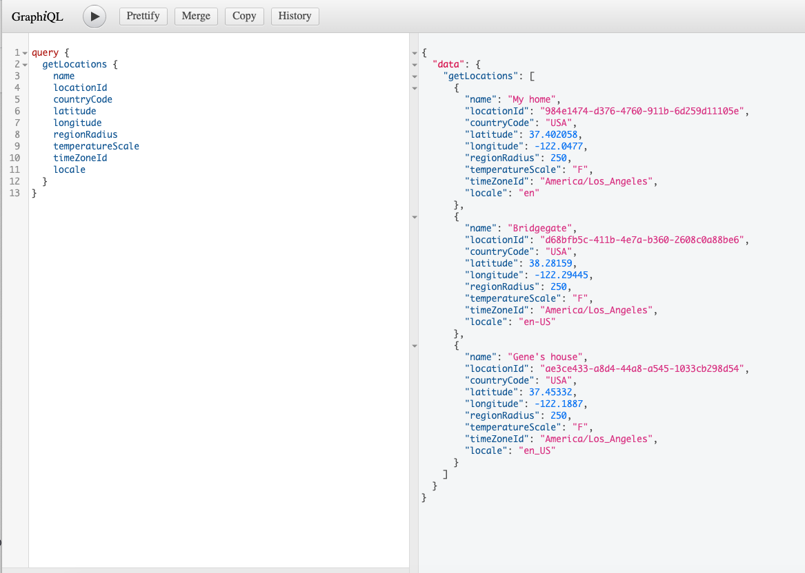
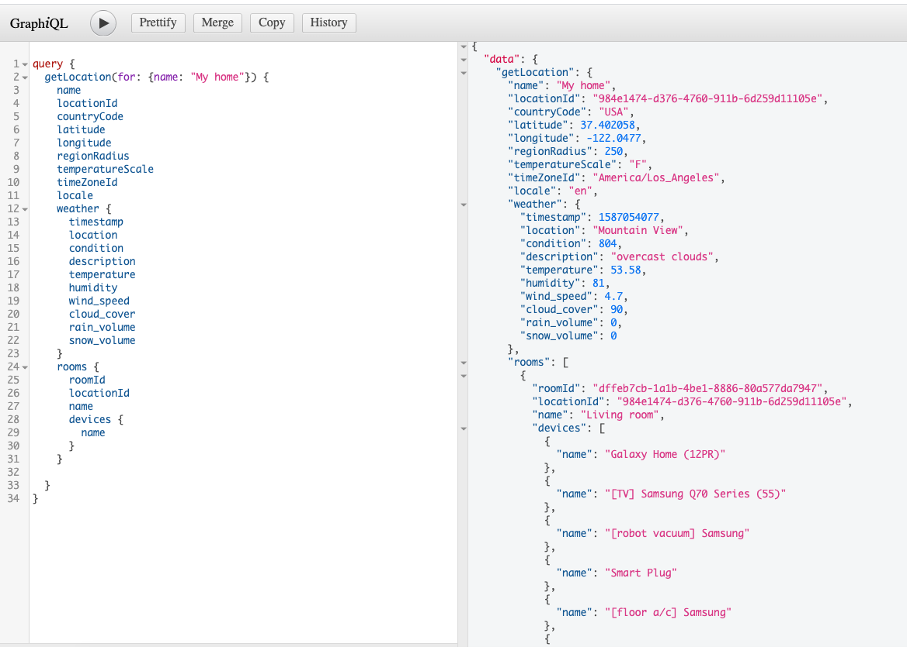

## smartThingsGraph

This is a GraphQL based abstraction layered over the current REST API for smartThings. It also provides the basis for both service and application augmentation

## Dependancies

The core external dependancy on this project is [Serverless](https://serverless.com/). This does require some setup to connect to your AWS. The best place to start is [here](https://serverless.com/framework/docs/getting-started/). If you are new to serverless then I would advise you also run through a quick tutorial such as [this one](https://serverless.com/framework/docs/providers/aws/guide/quick-start/)

## Setup

```
npm install .
```

This will install all the other dependencies and configure the project to run commands

### Commands

The following command will run the GraphQL API locally on Port 3000.

```
npm start
```

The following command will deploy the GraphQL API to AWS based on your configuration.

```
npm run deploy
```

The following command will run the unit and integration tests

```
npm test
```


The following command will run all the integration tests. Integration tests will test the GraphQl protocol the same way a client or user would via `GraphiQL`

```
npm run test:integration
```

### Deployment options

There are multiple deployment options for Homegraph. All of them require the addition of configuration. Configuration can be supplied via `.env` file. Which should contain the following keys

```
SMARTTHINGS_TOKEN=<Your smartThing access token>
FINHUB_KEY=<Finhub.com api key> _this is optional_
CLIMACELL_API=<climacell.com api key> _this is optional_
WTW_API=<what three words api key> _this is optional_
```


There are three main deployment models

1. AWS serverless component (default as described above)
2. Standalone Server (see ./integration/server)
3. NPM | Yarn package

This provides maximum flexibility for use of Homegraph

=======

### Screen shots

||
|:--:|
|*Query to get all Locations for account*|

||
|:--:|
|*Demonstrating the extension of SmartThings via services*|


